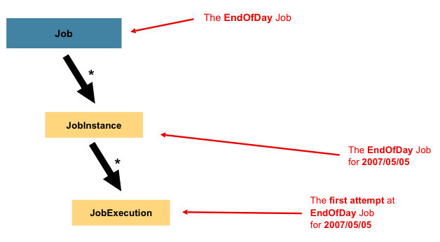

### **1. Job**
**Job**은 스프링 배치에서 실행 가능한 하나의 배치 작업을 나타내는 최상위 개념입니다.

- **특징**:
    - 배치 프로세스를 정의하는 논리적 단위입니다.
    - **여러 개의 Step**으로 구성됩니다.
    - 배치 작업이 수행할 전체적인 플로우를 정의합니다.
    - XML 구성 파일이나 Java Config(@Configuration)에서 정의할 수 있습니다.

- **구성 요소**:
    - **JobBuilderFactory**: Job을 생성할 때 사용됩니다.
    - **Step**: Job은 여러 Step으로 나뉘며, 각 Step은 실제 처리 로직(읽기, 처리, 쓰기)을 담당합니다.

- **예제 코드**:
```java
@Bean
public Job exampleJob(JobBuilderFactory jobBuilderFactory, Step exampleStep) {
    return jobBuilderFactory.get("exampleJob")
        .start(exampleStep) // 첫 번째 Step 설정
        .build();           // Job 빌드
}
```

---

### **2. JobInstance**
**JobInstance**는 Job의 실행 단위를 나타냅니다.

- **특징**:
    - **Job + JobParameters** 조합으로 정의됩니다.
    - 동일한 Job이라도 **JobParameters**가 다르면 새로운 JobInstance가 생성됩니다.
    - 한 JobInstance는 여러 번 실행될 수 있으며, 이를 각각 **JobExecution**이라고 부릅니다.

- **역할**:
    - Job의 `실행 상태를 관리`하고 추적합니다.
    - 중복 실행 방지: 스프링 배치는 동일한 JobParameters를 가진 JobInstance가 이미 존재하는 경우 새로 실행하지 않습니다.

- **예제**:
    - `Job` 이름이 `"exampleJob"`이고, `JobParameters`로 `date=2024-12-04`를 전달하면, 하나의 JobInstance가 생성됩니다.
    - 동일한 `Job`에 다른 `JobParameters`(예: `date=2024-12-05`)를 전달하면 새로운 JobInstance가 생성됩니다.

> 만약 일별로 배치를 해야 된다면 몇번을 돌려도 결과가 동일해야 하지 않을까 하는 생각이 든다. 만약 그렇지 않다면 너무 프로세스가 복잡해지지 않을까? 물론 비지니스에 따라 그렇지 않을 경우도 있겠지만 기본적으로 멱등성의 원칙이 매우 중요할 것 같다. 물론 `source가 동일`하다는 전제하에 멱등성이 유지되어야 할 것이다.
---

### **Job과 JobInstance의 관계**
- **Job**: 배치 처리의 논리적 정의(템플릿 역할).
- **JobInstance**: Job이 특정 파라미터로 실행될 때 생성되는 실제 실행 단위.

| 개념         | 정의                                 | 예시                                      |
|--------------|-------------------------------------|-------------------------------------------|
| **Job**       | 배치 작업의 정의                     | "월간 데이터 처리 Job"                      |
| **JobInstance** | Job + JobParameters로 생성된 실행 단위 | "월간 데이터 처리 Job (2024-12-04 기준)"    |

---

### **추가 정보: JobInstance와 상태**
스프링 배치는 **JobInstance**의 상태를 관리하며, 다음과 같은 상태값을 가집니다:
- **COMPLETED**: 성공적으로 완료.
- **FAILED**: 실패.
- **STOPPED**: 중단됨.
- **STARTING / STARTED**: 실행 중이거나 실행 준비 상태.

이 상태값은 재실행 로직이나 실패한 배치 작업 복구에 유용하게 활용됩니다.

---

궁금한 점이 있거나 추가로 알고 싶은 사항이 있으면 말씀해주세요! 😊

